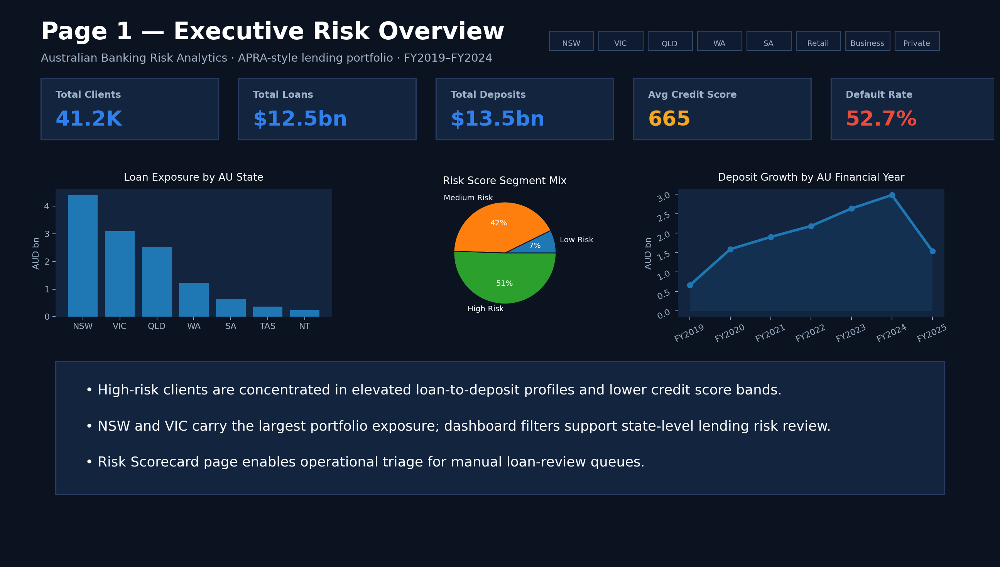
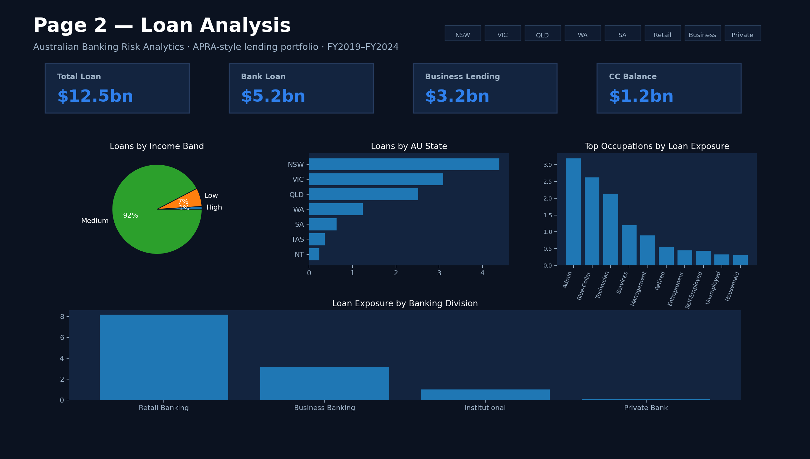
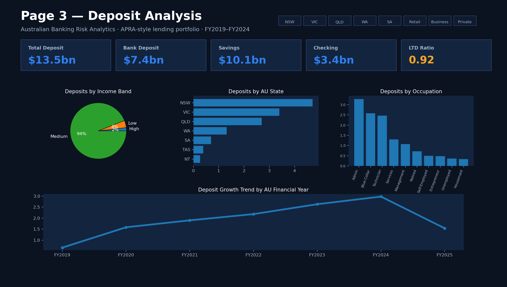
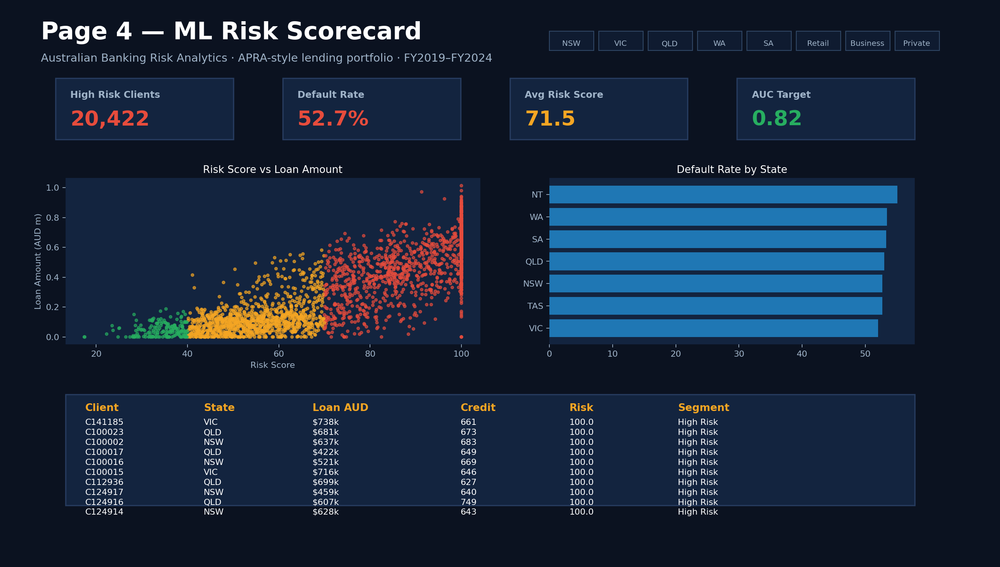
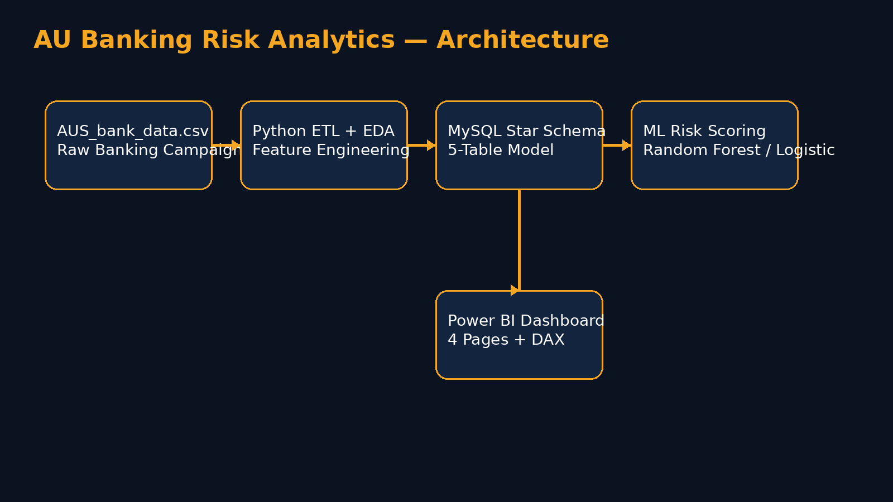

# Risk Analytics Dashboard — Australian Banking Sector 2026



## Project Objective
Build a recruiter-ready **Power BI risk analytics dashboard** for the Australian banking sector using the uploaded `AUS_bank_data.csv` dataset and a modern 2026 analytics workflow.

The goal is to help lending teams identify high-risk applicants, review loan exposure by Australian state, monitor deposits, and prioritise manual reviews using a machine-learning risk score.


## Tools Used
- **Python**: data cleaning, feature engineering, risk scoring, ML model script
- **Pandas / NumPy**: ETL and derived lending metrics
- **MySQL**: 5-table relational/star schema
- **Power BI**: dashboard design, DAX measures, state-level filtering
- **Australian banking context**: AU states, AU financial year, Retail/Business/Private/Institutional banking divisions

## Dataset
Source file used in this project:

`data/raw/AUS_bank_data.csv`

The uploaded dataset includes customer demographic, campaign, default, loan, housing, contact, target, and Australian state fields. To make it suitable for a banking risk dashboard, the project creates derived lending fields:

- loan amount
- deposit amount
- checking and saving balances
- credit score
- debt-to-income ratio
- loan-to-deposit ratio
- risk score from 0–100
- risk segment: Low, Medium, High
- Australian financial year

## Dashboard Pages

### Page 1 — Executive Risk Overview


Includes:
- Total Clients
- Total Loans
- Total Deposits
- Average Credit Score
- Default Rate
- Loan exposure by AU state
- Risk segment mix
- Deposit growth by Australian financial year

### Page 2 — Loan Analysis


Includes:
- Total Loan
- Bank Loan
- Business Lending
- Credit Card Balance
- Loans by income band
- Loans by AU state
- Loans by occupation
- Loans by banking division

### Page 3 — Deposit Analysis


Includes:
- Total Deposits
- Bank Deposits
- Savings
- Checking
- Loan-to-Deposit Ratio
- Deposit growth trend by AU financial year

### Page 4 — ML Risk Scorecard


Includes:
- High Risk Clients
- Default Rate
- Average Risk Score
- Risk Score vs Loan Amount scatter plot
- Default rate by state
- Top 10 high-risk customers table

## Data Model



### Tables
- `dim_client`
- `dim_loan_product`
- `fact_banking_relationship`
- `dim_advisor`
- `dim_date`

## Key Risk Features
The project engineers the following fields for risk analytics:

| Feature | Purpose |
|---|---|
| `credit_score` | Indicates creditworthiness |
| `debt_to_income_ratio` | Measures borrower repayment pressure |
| `loan_to_deposit_ratio` | Measures lending exposure against deposits |
| `risk_score` | 0–100 score used for dashboard segmentation |
| `risk_segment` | Low / Medium / High risk grouping |
| `default_flag` | Target flag for model training |

## DAX Measures

```DAX
Total Clients = DISTINCTCOUNT(dim_client[client_id])

Total Loan Amount = SUM(fact_banking_relationship[loan_amount])

Total Deposit Amount = SUM(fact_banking_relationship[deposit_amount])

Default Rate % =
DIVIDE(
    COUNTROWS(FILTER(fact_banking_relationship, fact_banking_relationship[default_flag] = 1)),
    COUNTROWS(fact_banking_relationship)
) * 100

LTD Ratio = DIVIDE([Total Loan Amount], [Total Deposit Amount])

High Risk Clients =
COUNTROWS(FILTER(fact_banking_relationship, fact_banking_relationship[risk_score] >= 71))

Avg Risk Score = AVERAGE(fact_banking_relationship[risk_score])
```

## Folder Structure

```text
au_banking_risk_analytics_2026/
├── assets/
│   ├── diagrams/
│   └── screenshots/
├── data/
│   ├── raw/
│   └── processed/
├── docs/
├── notebooks/
├── powerbi/
├── sql/
└── src/
```

## How to Run

### 1. Install Python packages
```bash
pip install pandas numpy scikit-learn matplotlib
```

### 2. Run the ETL / ML script
```bash
cd src
python risk_eda_model.py
```

### 3. Load into MySQL
Use:

```text
sql/schema_mysql.sql
```

Then import the processed CSV files from `data/processed/`.

### 4. Build Power BI Report
Import these files:
- `dim_client.csv`
- `dim_loan_product.csv`
- `dim_advisor.csv`
- `dim_date.csv`
- `fact_banking_relationship.csv`

Create relationships:
- `dim_client[client_id]` → `fact_banking_relationship[client_id]`
- `dim_loan_product[product_id]` → `fact_banking_relationship[product_id]`
- `dim_advisor[advisor_id]` → `fact_banking_relationship[advisor_id]`
- `dim_date[date]` → `fact_banking_relationship[date]`

## Business Impact
- Enables lenders to prioritise high-risk applicants
- Supports state-level portfolio risk review
- Improves lending visibility across Retail, Business, Private Bank, and Institutional divisions
- Adds an ML-style risk scoring layer suitable for Big 4 and Australian banking analytics interviews

